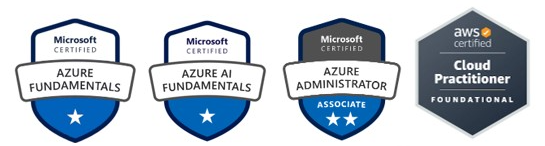

  

 

## Sobre mim:
- 📚 Formada em Matemática, técnica em edificações, atualmente cursando Análise e Desenvolvimento de Sistemas.
- 💼 Trabalho como Arquiteta Cloud Jr na <a href="http://saphira.tech/" target="_blank" rel="noopener noreferrer">Saphira</a>.
- 💻 Em formação técnica, aprimorando habilidades em Desenvolvedora FullStack e DevOps/Cloud.
- ⚡ Debug da minha essência: Compilo ideias na nuvem, debugo desafios com café e paixão — mas é nos doramas que me perco (e me acho nas reviravoltas de enredo!)  e na dança que viro código livre: intensa, imprevisível e impossível de parar. 

## Como Me Encontrar:

 
   
 	
   
  

 
<!-- GitHub Stats com fundo preto e cores pink e roxo -->

  
  

  

## Main Skills:
 

  
  
  
  
  
  
  
  
  
  

## Studying in this moment:

  
   
  
  
  
  

## Technical Certifications:

  

